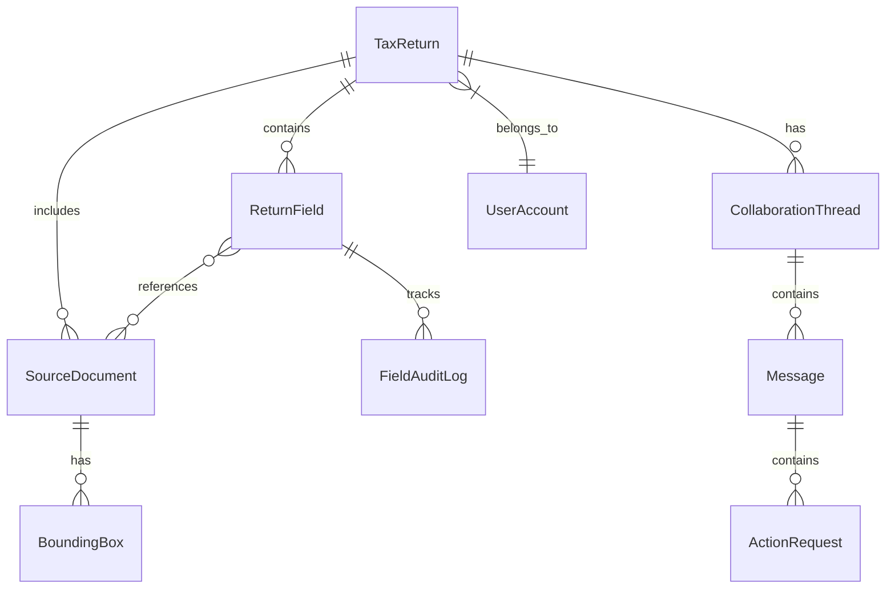

# Phase 1: Data Model Specification

**Feature**: `001-ai-tax-platform`  
**Date**: 2026-08-27  
**Status**: Completed  

---

## 1. Core Entity Architecture



---

## 2. Entity Definitions

### 2.1 TaxReturn
Represents an individual or business tax return filing for a tax year.

| Field | Type | Description |
|---|---|---|
| `id` | `string` | Unique identifier (e.g. `ret-1040-marcus-2025`) |
| `taxYear` | `number` | Tax year (e.g. `2025`) |
| `returnType` | `'1040' \| '1120S' \| '1065' \| '1041'` | Form type |
| `taxpayerName` | `string` | Primary taxpayer / business name |
| `taxpayerEmail` | `string` | Taxpayer contact email |
| `assignedPreparerId` | `string` | Assigned CPA preparer ID |
| `assignedReviewerId` | `string` | Assigned senior reviewer ID |
| `status` | `ReturnStatus` | Current workflow stage (see 2.6) |
| `clientMilestone` | `ClientMilestone` | Client-facing simplified milestone |
| `nextActionOwner` | `'client' \| 'preparer' \| 'reviewer' \| 'irs'` | Who owns next step |
| `nextActionDescription` | `string` | Human-readable next action summary |
| `dueDate` | `string` | ISO date string for filing deadline |
| `isBlocked` | `boolean` | Flag indicating blocking issue |
| `blockerReason` | `string?` | Reason for block if applicable |
| `triageScore` | `number` | Computed priority score (0-100+) |
| `totalIncome` | `number` | Calculated total gross income |
| `taxLiability` | `number` | Calculated total tax liability |
| `refundOrDueAmount` | `number` | Positive for refund, negative for amount owed |
| `documentCount` | `number` | Total associated documents |
| `openIssueCount` | `number` | Open requests/clarifications |
| `aiConfidenceAvg` | `number` | Average AI confidence (0-100%) |

---

### 2.2 ReturnField (Tax Line Item with Affordance & Traceability)
Represents a specific line item on a tax return (e.g. Schedule C Line 1 Gross Receipts).

| Field | Type | Description |
|---|---|---|
| `id` | `string` | Unique field ID (e.g. `fld-sched-c-gross-receipts`) |
| `returnId` | `string` | Parent return ID |
| `formCode` | `string` | Form / Schedule (e.g. `Form 1040`, `Schedule C`, `Schedule 1`) |
| `lineNumber` | `string` | Line label (e.g. `Line 1a`, `Line 24`) |
| `label` | `string` | Field label (e.g. `Gross receipts or sales`) |
| `value` | `number \| string` | Raw value |
| `formattedValue` | `string` | Currency/formatted string (e.g. `$142,500.00`) |
| `state` | `AffordanceState` | `ai_extracted` \| `verified` \| `user_edited` \| `calculated_locked` \| `requires_approval` |
| `aiConfidence` | `number` | Confidence score (0-100%) |
| `aiExplanation` | `AIExplainability` | Detailed explainability payload (see 2.7) |
| `sourceDocumentIds` | `string[]` | IDs of source documents feeding this field |
| `sourceBoundingBoxIds`| `string[]` | Coordinate references on source documents |
| `formula` | `string?` | Calculation formula if computed (e.g. `Sum(1099-NEC.Box1)`) |
| `lastModifiedBy` | `string` | User ID or `ai_extractor` |
| `lastModifiedAt` | `string` | ISO timestamp |

---

### 2.3 SourceDocument & BoundingBox
Represents uploaded client tax documents, receipts, statements, and worksheets.

| Field | Type | Description |
|---|---|---|
| `id` | `string` | Unique doc ID (e.g. `doc-1099nec-acme-corp`) |
| `returnId` | `string` | Associated tax return ID |
| `fileName` | `string` | Original file name (e.g. `1099-NEC_Acme_Corp_2025.pdf`) |
| `docType` | `DocumentType` | `W2` \| `1099_NEC` \| `1099_DIV` \| `1099_INT` \| `1098` \| `K1` \| `RECEIPT` \| `BANK_STMT` \| `OTHER` |
| `category` | `'income' \| 'deductions' \| 'credits' \| 'identity' \| 'workpapers'` | High-level category |
| `pageCount` | `number` | Number of pages |
| `uploadedAt` | `string` | Upload timestamp |
| `uploadedBy` | `string` | Uploader name |
| `status` | `'processed' \| 'needs_review' \| 'processing' \| 'rejected'` | Document processing status |
| `extractedFields` | `Record<string, any>` | Key-value pairs extracted by AI |
| `boundingBoxes` | `BoundingBox[]` | Coordinate highlights on document |

**BoundingBox Schema**:
```typescript
interface BoundingBox {
  id: string;
  pageNumber: number;
  x: number;      // percentage from left (0-100)
  y: number;      // percentage from top (0-100)
  width: number;  // percentage width (0-100)
  height: number; // percentage height (0-100)
  label: string;  // e.g. "Box 1: Nonemployee Compensation"
  fieldKey: string;
  extractedValue: string;
  confidence: number;
}
```

---

### 2.4 CollaborationThread & Message (Contextual Communication)
Represents conversations tied to specific returns, forms, or documents.

| Field | Type | Description |
|---|---|---|
| `id` | `string` | Unique thread ID (e.g. `th-mileage-deduction-2025`) |
| `returnId` | `string` | Parent return ID |
| `contextType` | `'field' \| 'document' \| 'return' \| 'questionnaire'` | Scope of the conversation |
| `contextId` | `string` | ID of the target field or document |
| `contextLabel` | `string` | Display label (e.g. `Schedule C: Vehicle Mileage Deduction`) |
| `status` | `'open' \| 'waiting_client' \| 'waiting_cpa' \| 'resolved'` | Thread status |
| `messages` | `Message[]` | Ordered list of messages |

**Message Schema**:
```typescript
interface Message {
  id: string;
  threadId: string;
  senderId: string;
  senderName: string;
  senderRole: UserRoleType;
  timestamp: string;
  content: string;
  isInternalFirmOnly: boolean; // TRUE: Firm note, FALSE: Client visible
  actionRequest?: {
    type: 'upload_document' | 'clarify_number' | 'e_sign' | 'confirm_yes_no';
    description: string;
    isCompleted: boolean;
    responsePayload?: any;
  };
}
```

---

### 2.5 User Accounts & Authentication Model

The platform utilizes an authentic **"Saved Logins / Account Chooser"** landing screen (`SavedLoginsScreen`) featuring 4 realistic persona accounts:

| Account Identifier | Name & Title | Email | Role Key | Default View / Permissions |
|---|---|---|---|---|
| `prep-sam-wilson` | **Sam Wilson, CPA** | `sam.wilson@miraflores.tax` | `tax_preparer` | Actionable triage dashboard, return preparation, side-by-side traceability, internal notes |
| `rev-steve-rogers`| **Steve Rogers** (Senior Tax Director) | `steve.rogers@miraflores.tax` | `tax_reviewer` | Full review controls, verify overrides, sign-off gatekeeper, triage oversight, IRS lock |
| `client-tony-stark`| **Tony Stark** (Individual Taxpayer) | `tony.stark@starkenterprises.com` | `individual_client` | Client Portal with 7-stage progress bar, document uploads, action replies, Form 8879 e-sign |
| `client-peter-parker`| **Peter Parker** (Freelance Taxpayer) | `peter.parker@nyu.edu` | `individual_client` | Client Portal with 7-stage progress bar, missing 1099 chasers, equipment receipt upload |

**Post-Login Personal Return Mode**:
- For firm employees/preparers, personal tax filing is accessed **from within the top-right navbar account menu** (`Switch to My Personal Return`), which securely opens Dr. Bruce Banner's private employee Form 1040 (`ret-bruce-1040`) while strictly isolating personal files from the firm roster.

---

### 2.6 Workflow Stages & Client Progress Bar Mapping

The Client Portal maps the lifecycle to a 6-stage **Return Progress Bar** positioned directly below the navbar, centered at ~60% screen width (`max-w-4xl mx-auto`), with concise 2-3 word stage titles (no internal extraction stage exposed to the client):

| CPA Granular Stage | Client Progress Bar Stage Title (2-3 Words) | Next Action Owner |
|---|---|---|
| `INTAKE` (85% Docs Received) / `EXTRACTION` | **1. Documents Intake** | Client |
| `PREPARATION` (Active Preparation & Workpapers) | **2. Expert Prep** | Tax Preparer |
| `REVIEW` (Senior QA & Partner Sign-off) | **3. Partner Review** | Tax Reviewer |
| `CLIENT_SIGN` (Form 8879 Authorization) | **4. Client Signature** | Client (e-Sign 8879) |
| `E_FILED` (Transmitted to IRS) | **5. IRS Submission** | Automated / IRS |
| `ACCEPTED` (Filing Complete) | **6. Return Accepted** 🎉 | Completed |

---

### 2.7 AI Explainability Payload (`AIExplainability`)

```typescript
interface AIExplainability {
  summary: string;
  confidenceScore: number; // 0 to 100
  evidence: {
    sourceDocumentName: string;
    pageNumber: number;
    boxLabel: string;
    extractedText: string;
    boundingBoxId: string;
  }[];
  calculationBreakdown?: {
    formula: string;
    inputs: { label: string; value: number; docRef: string }[];
  };
  uncertaintyFactors: string[];
  suggestedAction: string;
  correctionHistory?: {
    originalValue: any;
    correctedValue: any;
    correctedBy: string;
    timestamp: string;
  }[];
}
```
