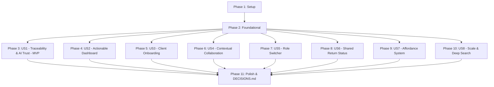

# Tasks: AI-Powered Tax Platform (MiraFlores AI)

**Input**: Design documents from `/specs/001-ai-tax-platform/` (`spec.md`, `plan.md`, `research.md`, `data-model.md`, `contracts/`, `quickstart.md`)  
**Constitution**: `.specify/memory/constitution.md` (v1.0.0 — shadcn preset `buHOvz6`, zero backend, simulated AI, mandatory `DECISIONS.md`)  
**Scope**: 10 Product Challenges, 8 User Stories, 3 Core Roles (`individual_client`, `tax_preparer`, `tax_reviewer`) + personal return mode, 120+ mock documents.

---

## Phase 1: Setup (Shared Infrastructure)

**Purpose**: Project initialization with Vite, React 19, Tailwind CSS v4.3, shadcn/ui (`buHOvz6`), and base TypeScript configuration.

- [X] T001 Initialize Vite React 19 project structure with TypeScript in package.json and vite.config.ts
- [X] T002 Configure Tailwind CSS v4.3 and PostCSS in src/index.css and tailwind.config.ts with container horizontal scroll utilities (overflow-x-auto, min-w-*) and custom scrollbars
- [X] T003 [P] Setup shadcn/ui components (buHOvz6 preset) and utils in src/lib/utils.ts and components.json
- [X] T004 [P] Create initial architecture documentation and master decision log in DECISIONS.md

---

## Phase 2: Foundational (Blocking Prerequisites)

**Purpose**: Core TypeScript types, deterministic Avengers-themed mock dataset (120+ documents, 8 returns), and pure in-memory ephemeral Zustand store with role-gated session isolation.

**⚠️ CRITICAL**: No user story work can begin until this phase is complete.

- [X] T005 [P] Implement core TypeScript interfaces in src/types/index.ts (TaxReturn, ReturnField, SourceDocument, BoundingBox, CollaborationThread, Message, UserRoleType, AffordanceState)
- [X] T006 [P] Implement deterministic mock dataset generator in src/data/mockReturns.ts (8 Avengers returns: Tony Stark 1040/Sched C, Stark Industries 1120S, Peter Parker 1040, Natasha Romanoff 1040, Wakanda Tech 1065, Bruce Banner 1040 employee personal, Pym Quantum 1120S, Avengers Compound 1065)
- [X] T007 [P] Implement source documents and bounding box generator in src/data/mockDocuments.ts (120+ documents: W-2s, 1099-NEC, 1099-DIV, K-1s, 150+ receipts with exact coordinates)
- [X] T008 [P] Implement mock contextual threads and action requests in src/data/mockThreads.ts (pre-seeded internal notes and client action requests)
- [X] T009 Implement triage priority scoring algorithm in src/store/triageLogic.ts (urgency formula based on deadline, blockers, complexity, and reviewer status)
- [X] T010 Implement pure in-memory ephemeral Zustand store with session isolation, role selectors, and synchronous real-time mutation actions (zero LocalStorage/SessionStorage complexity) in src/store/usePlatformStore.ts
- [X] T011 Create master navigation layout with top-bar Role Switcher and breadcrumb context in src/components/common/Header.tsx

**Checkpoint**: Foundation ready — pure in-memory mock store and layout operational.

---

## Phase 3: User Story 1 - CPA Inspects Source Document Traceability & AI Trust (Priority: P1) 🎯 MVP

**Goal**: Enable a CPA reviewer to click on any Form 1040/Schedule C field (e.g. Tony Stark Gross Receipts $142,500), open an interactive side-by-side split screen showing source 1099-NEC documents with highlighted coordinate bounding boxes, inspect calculation formulas, and view trustworthy AI explainability with 1-click verification or inline correction (ensuring horizontal scrolling and min-width preservation prevent content squeezing).

**Independent Test**: Select Tony Stark -> Open Schedule C -> Click Line 1 ($142,500) -> Verify side-by-side drawer renders 1099-NEC with highlighted Box 1 bounding box, calculation breakdown ($45k + $55k + $42.5k), and AI explainability card -> Click "Verify" to lock field.

- [ ] T012 [P] [US1] Build coordinate-based SVG document page renderer with bounding-box highlights in src/components/document-viewer/DocumentViewer.tsx
- [ ] T013 [P] [US1] Build 5-state AffordanceCell component (AI-extracted, verified, manual, locked, approval required) with fixed non-collapsing widths in src/components/return-review/AffordanceCell.tsx
- [ ] T014 [US1] Build Form 1040 & Schedule C interactive grid with min-width preservation (min-w-[850px]) and container horizontal scroll (overflow-x-auto) in src/components/return-review/TaxFormViewer.tsx
- [ ] T015 [US1] Build AI Explainability Card (summary, confidence gauge, evidence list, uncertainty reasons, inline correction) in src/components/ai-explainability/AIExplainabilityCard.tsx
- [ ] T016 [US1] Build calculation formula breakdown modal/drawer in src/components/return-review/FormulaBreakdown.tsx
- [ ] T017 [US1] Integrate side-by-side split review workbench with dual-pane horizontal scrolling container in src/components/return-review/ReturnReviewWorkbench.tsx
- [ ] T018 [US1] Record traceability, AI explainability, and horizontal scroll viewport decisions in DECISIONS.md

**Checkpoint**: User Story 1 (MVP) is fully functional and testable independently.

---

## Phase 4: User Story 2 - CPA Prioritizes Work via Actionable Dashboard (Priority: P1)

**Goal**: Deliver a CPA workbench that answers "What should I work on right now?" by organizing returns into decision-driven triage queues (Urgent / At Risk, Ready for Review, Blocked on Client, Ready to File) across 100+ returns, with primary action buttons and quick filters.

**Independent Test**: Navigate to CPA Dashboard as Steve Rogers (Reviewer) -> Verify triage ranking (Pym Quantum Tech ranked #1 due to <48h deadline) -> Filter by "Blocked on Client" -> Instant filter response across all returns -> Click "Start Review" to jump directly into return.

- [ ] T019 [P] [US2] Build urgency metric KPI summary cards in src/components/dashboard/TriageKpiCards.tsx
- [ ] T020 [P] [US2] Build actionable triage queue card with container horizontal scroll (overflow-x-auto) and fixed column widths in src/components/dashboard/TriageQueueCard.tsx
- [ ] T021 [US2] Build multi-faceted return search and filter bar (by status, deadline, assigned preparer, blocker) in src/components/dashboard/DashboardFilters.tsx
- [ ] T022 [US2] Build team workload distribution view for managers in src/components/dashboard/TeamWorkloadView.tsx
- [ ] T023 [US2] Assemble master Actionable CPA Dashboard with scroll-safe container layout in src/components/dashboard/CpaDashboard.tsx
- [ ] T024 [US2] Record triage prioritization and dashboard information architecture decisions in DECISIONS.md

**Checkpoint**: User Story 2 is functional and integrated with User Story 1.

---

## Phase 5: User Story 3 - New Client Onboarding in Under 10 Seconds (Priority: P2)

**Goal**: Deliver a zero-jargon, 10-second first-run client experience (Peter Parker - Freelance Photography) featuring 3 immediate action cards, estimated completion times, drag-and-drop intake zone, and progressive onboarding transition.

**Independent Test**: Switch role to Individual Taxpayer (Peter Parker) -> Observe 10-second action cards -> Upload W-2 -> Observe progress bar increment from 0% to 33% and completion checkmark.

- [ ] T025 [P] [US3] Build welcoming 10-second orientation banner and time estimates in src/components/onboarding/OnboardingHeader.tsx
- [ ] T026 [P] [US3] Build 3-step prioritized action cards (Upload W-2/1099, Answer Life Questions, Prior Year Review) in src/components/onboarding/OnboardingActionCard.tsx
- [ ] T027 [US3] Build interactive simulated document upload dropzone in src/components/onboarding/DocumentUploadDropzone.tsx
- [ ] T028 [US3] Build 4-question interactive tax life-events questionnaire in src/components/onboarding/LifeEventsQuestionnaire.tsx
- [ ] T029 [US3] Assemble client onboarding view with dynamic transition to active return tracker in src/components/onboarding/ClientOnboardingView.tsx
- [ ] T030 [US3] Record time-to-first-action and progressive disclosure onboarding decisions in DECISIONS.md

**Checkpoint**: User Story 3 is functional and provides clean client intake experience.

---

## Phase 6: User Story 4 - Contextual Collaboration & Request Tracking (Priority: P2)

**Goal**: Provide a communication layer directly attached to documents and return lines, with unambiguous visual separation between Internal Firm Notes (amber banner, hidden from client) and Client Questions (blue banner, creates actionable request on client dashboard).

**Independent Test**: As Sam Wilson (Preparer), create a "Client Question" thread on Tony Stark Schedule C Line 9 travel deduction -> Switch to Tony Stark (Client) -> Verify prominent notification banner on client dashboard with reply and upload button -> Verify internal notes from Steve Rogers are strictly invisible to client.

- [ ] T031 [P] [US4] Build ThreadMessageItem component with visual internal vs. client badge and permission indicators in src/components/collaboration/ThreadMessageItem.tsx
- [ ] T032 [P] [US4] Build ActionRequestCard component (with 1-click resolve, file attach, text response) in src/components/collaboration/ActionRequestCard.tsx
- [ ] T033 [US4] Build ContextualThreadDrawer component attached to specific fields/documents in src/components/collaboration/ContextualThreadDrawer.tsx
- [ ] T034 [US4] Build client-facing outstanding requests widget in src/components/collaboration/ClientRequestsWidget.tsx
- [ ] T035 [US4] Record contextual collaboration and permission boundary decisions in DECISIONS.md

**Checkpoint**: User Story 4 is functional with verified client/firm privacy isolation.

---

## Phase 7: User Story 5 - Role Switcher & Context Preservation (Priority: P2)

**Goal**: Provide an interactive Role Switcher supporting 3 core roles (`individual_client`, `tax_preparer`, `tax_reviewer`) plus an employee personal return toggle (Bruce Banner), with explainable disabled states, permission tooltips, and context preservation across role transitions.

**Independent Test**: Switch between Peter Parker (Client), Sam Wilson (Preparer), and Steve Rogers (Reviewer) -> Verify navigation, buttons, and views adapt immediately -> Switch to Bruce Banner personal return mode -> Verify internal reviewer notes on Bruce's return are masked per independence policies.

- [ ] T036 [P] [US5] Build interactive top-bar Role Switcher dropdown with persona avatars and role descriptions in src/components/common/RoleSwitcher.tsx
- [ ] T037 [P] [US5] Build explainable disabled action buttons with permission tooltips in src/components/common/PermissionGateButton.tsx
- [ ] T038 [US5] Implement Employee Personal Return Mode with masked reviewer notes in src/components/common/PersonalReturnBanner.tsx
- [ ] T039 [US5] Implement context dock preserving active return position across views in src/components/common/ContextDock.tsx
- [ ] T040 [US5] Record role architecture and permission communication decisions in DECISIONS.md

**Checkpoint**: User Story 5 is functional with instant role switching.

---

## Phase 8: User Story 6 - Shared Return Status & Progress (Priority: P3)

**Goal**: Deliver an unambiguous status experience with dual views: granular 7-stage internal tracking for CPAs (Intake, Extraction, Prep, Review, Client Sign, E-Filed, Accepted) vs. 6 reassuring milestone stages for clients, featuring explicit Next Action Owner and blocker badges.

**Independent Test**: View Tony Stark return as CPA (shows 7 granular stages with blocker flag) -> View as Client (shows Milestone 3: "Under Expert Review" with reassuring progress bar and explicit Next Action: "CPA preparing Schedule C").

- [ ] T041 [P] [US6] Build CPA Granular Lifecycle Stepper with blocker indicators in src/components/status/CpaStatusStepper.tsx
- [ ] T042 [P] [US6] Build Client Reassuring Milestone Progress Bar in src/components/status/ClientMilestoneProgress.tsx
- [ ] T043 [US6] Build Next Action Owner & Blocker Callout Banner in src/components/status/NextActionBanner.tsx
- [ ] T044 [US6] Record status legibility and shared mental model decisions in DECISIONS.md

**Checkpoint**: User Story 6 is functional with zero status ambiguity.

---

## Phase 9: User Story 7 - Consistent Visual Language for Affordances (Priority: P3)

**Goal**: Enforce the 5-state affordance visual language across every table, workpaper, and review screen so users immediately distinguish AI-extracted, verified, human-edited, calculated-locked, and approval-required data without layout squeezing.

**Independent Test**: Inspect Form 1040 line items -> Hover over calculated cell (shows lock and formula tooltip) -> Hover over human-edited cell (shows edit history) -> Click AI-extracted cell (opens explainability drawer).

- [ ] T045 [P] [US7] Build interactive AffordanceLegend guide component in src/components/return-review/AffordanceLegend.tsx
- [ ] T046 [US7] Apply 5-state affordance badges and fixed non-collapsing column widths (min-w-fit, overflow-x-auto) across all tax schedules in src/components/return-review/ScheduleTable.tsx
- [ ] T047 [US7] Build manual value edit modal with audit reason tracking in src/components/return-review/ManualEditModal.tsx
- [ ] T048 [US7] Record affordance design tokens and interaction standards in DECISIONS.md

**Checkpoint**: User Story 7 is functional across all data entry surfaces.

---

## Phase 10: User Story 8 - Scalable Navigation & Deep Search for Complex Returns (Priority: P3)

**Goal**: Enable fast navigation and search over complex returns with 150+ documents (Wakanda Tech & Design LLC 1065) using multi-attribute filters, tree views, and batch operations without UI lag or table squeezing.

**Independent Test**: Select Wakanda Tech & Design LLC -> Open Document Hub -> Search for "Vibranium" -> Filter by Type = RECEIPT, Amount > $5000 -> Verify sub-second response across 150+ items -> Select all filtered items and trigger batch verification.

- [ ] T049 [P] [US8] Build high-performance document tree and category sidebar in src/components/document-hub/DocumentCategoryTree.tsx
- [ ] T050 [P] [US8] Build multi-faceted document filter bar (type, category, amount, AI confidence, status) in src/components/document-hub/DocumentFilters.tsx
- [ ] T051 [US8] Build virtualized/paginated document list grid with horizontal scroll container (overflow-x-auto, min-w-[900px]) and batch action toolbar in src/components/document-hub/DocumentListGrid.tsx
- [ ] T052 [US8] Assemble scalable Document Hub view in src/components/document-hub/DocumentHub.tsx
- [ ] T053 [US8] Record progressive disclosure and scale handling decisions in DECISIONS.md

**Checkpoint**: User Story 8 is functional and smoothly handles 150+ documents.

---

## Phase 11: Polish & Cross-Cutting Concerns

**Purpose**: Assemble the master App shell, wire all challenge views together, complete DECISIONS.md and README.md, and run end-to-end quickstart validation.

- [ ] T054 [P] Wire all domain views, role routes, and context drawers in src/App.tsx and src/main.tsx
- [ ] T055 [P] Complete master decision log documenting pure in-memory ephemeral store architecture, horizontal scrolling strategy, and all 10 challenge solutions in DECISIONS.md
- [ ] T056 [P] Complete README.md detailing what is reactive in the UI vs. what is simulated behind the scenes
- [ ] T057 Run end-to-end interactive validation against all 10 scenarios in quickstart.md including responsive viewport and horizontal scroll test

---

## Dependencies & Execution Order

### Parallel Opportunities

- **Phase 1**: T003 (shadcn/ui setup) and T004 (DECISIONS.md) can run in parallel.
- **Phase 2**: T005 (Types), T006 (Returns data), T007 (Documents data), and T008 (Threads data) can run in parallel.
- **Phase 3 (MVP)**: T012 (SVG viewer) and T013 (AffordanceCell) can run in parallel.
- **Phase 4**: T019 (KPI cards) and T020 (Triage card) can run in parallel.
- **Phase 5**: T025 (Onboarding header) and T026 (Action cards) can run in parallel.
- **Phase 6**: T031 (Message item) and T032 (Action request) can run in parallel.
- **Phase 7**: T036 (Role switcher) and T037 (Permission buttons) can run in parallel.
- **Phase 8**: T041 (CPA stepper) and T042 (Client progress) can run in parallel.
- **Phase 10**: T049 (Category tree) and T050 (Filter bar) can run in parallel.
- **Phase 11**: T054 (App shell), T055 (DECISIONS.md), and T056 (README.md) can run in parallel.

---

## Implementation Strategy

### MVP Scope (Phase 1 + Phase 2 + Phase 3: User Story 1)
1. Initialize Vite React 19 + shadcn/ui + Tailwind CSS.
2. Build mock dataset (Tony Stark 1040, 1099-NECs with coordinate bounding boxes) and Zustand store.
3. Build side-by-side traceability review workbench with SVG document viewer, bounding-box highlights, formula breakdowns, and AI explainability card.
4. **Validate MVP**: Test Tony Stark Schedule C Gross Receipts ($142,500) tie-out to 1099-NEC with 1-click verification.

### Incremental Feature Additions
1. **MVP + Dashboard (US2)**: Actionable triage queue and manager views.
2. **+ Onboarding & Collaboration (US3, US4)**: Peter Parker 10-second flow and contextual internal/external threads.
3. **+ Role Architecture & Status (US5, US6, US7)**: 3-role switcher, Bruce Banner personal mode, dual status stepper, and affordance legend.
4. **+ Scale & Complexity (US8)**: Wakanda Tech 150+ receipt search and batch operations.
5. **+ Documentation (DECISIONS.md & README.md)**: Full decision rationale logging and real vs. simulated documentation.
